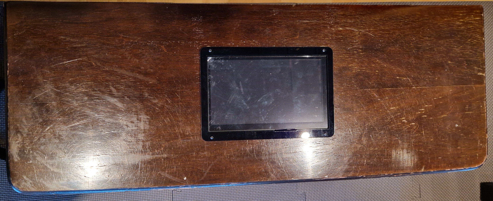
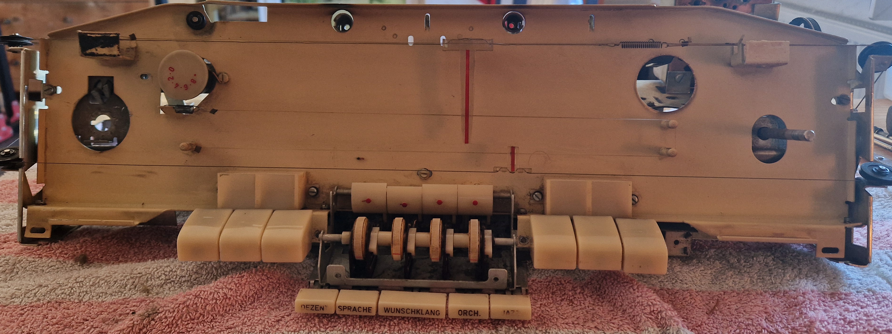

# Gehäuse - Touchdisplay
Hier geht es primär um den Einbau des Touchscreens in das Gehäuse.
Die erste Frage dazu war erstmal: "Wo machen wir das Display hin"?  

Hier gab es mehrere Möglichkeiten:  

- Frontal 
    - Bei dem Frontalen-Einbau war uns die "Veränderung" zum Retro-Look zu groß.

- Rückseite 
    -  Bei dem Einbau auf der Rückseite war uns die Platte zu dünn, dies hätte den ständigen Touch-Druck wahrscheinlich nicht ausgehalten.

- Oben 
    - Also haben wir uns entschlossen das Display Oben einzusetzen.

## Vorderseite

## Draufsicht

## Innenansicht

## Draufsicht - fertiger Einbau

## Vorderseite - fertig

Gleichzeitig haben wir der Glasscheibe und dem Chassie einen neuen Glanz verpasst.  

## Glasscheibe

## Chassie

