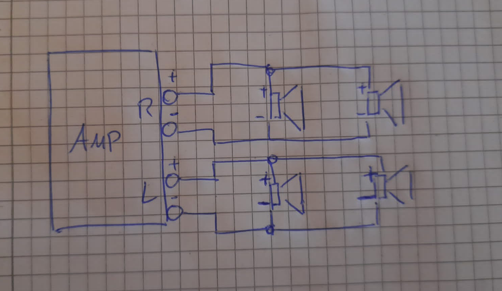

#Lautsprecher
 
Wir haben uns für eine günstige kleine passive Variante entschieden.  
Zuerst haben wir eine Skizze für die Schaltung gezeichnet.
Da wir den Radio nicht neu bespannen wollten, haben wir eine andere Möglichkeit gesucht die Lautsprecher zu befestigen.

Skizze Schaltplan Lautsprecher

Vorderseite Lautsprecherplatte

Befestigung Lautsprecher 1

Befestigung Lautsprecher 2

Lautsprecher Verkabelt
