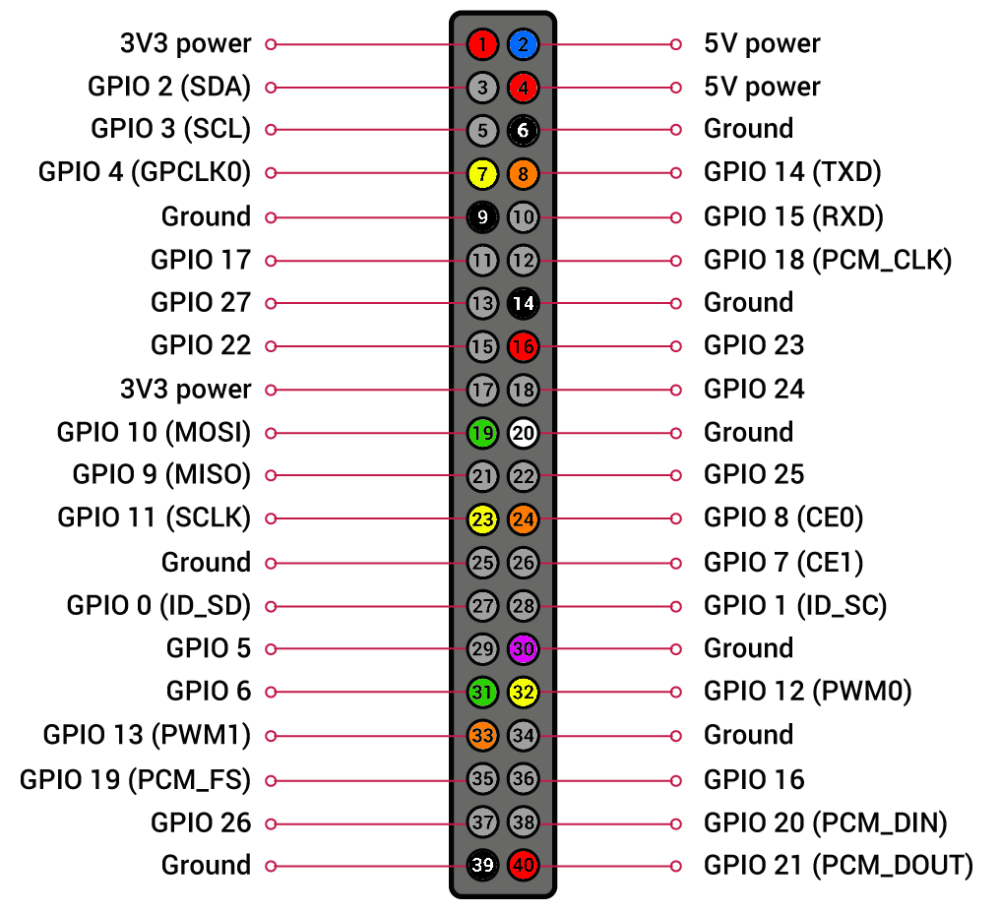

# Schaltplan

Für die technisch Versierten, gäbe es hier auch einen Schaltplan vom `Retro.I` wie wir den Radio aufgebaut haben.

## Schaltplan Retro.I

## GPIO-Pin Belegung
| PIN | Farbe | Verwendung |
|-----|-------|------------|
| 1   | ROT | 3,3V (Lüfter) |
| 2   | BLAU | 5V (Drehregler) |
| 4   | ROT | 5V (Touch-Display) |
| 6   | SCHWARZ | GROUND (Touch-Display) |
| 7   | GELB | CLK (Drehregler Bass UP) |
| 8   | ORANGE | DT (Drehregler Bass DOWN) |
| 9   | SCHWARZ | GROUND (Lüfter) |
| 14  | SCHWARZ | GROUND (Taster Shutdown) |
| 16  | ROT | Daten (Taster Shutdown) |
| 19  | GRÜN | Daten (LED-Streifen) |
| 20  | WEISS | GROUND (LED-Streifen) |
| 23  | GELB | CLK (Drehregler Höhen UP) |
| 24  | ORANGE | DT (Drehregler Höhen DOWN) |
| 30  | LILA | GROUND (Drehregler) |
| 31  | GRÜN | CLK (Drehregler Volume UP) |
| 32  | GELB | DT (Drehregler Volume DOWN) |
| 33  | ORANGE | SW (Drehregler Volume An/Aus) |
| 39  | SCHWARZ | GROUND (Button Trinkspruch) |
| 40  | ROT | Daten (Button Trinkspruch) |

