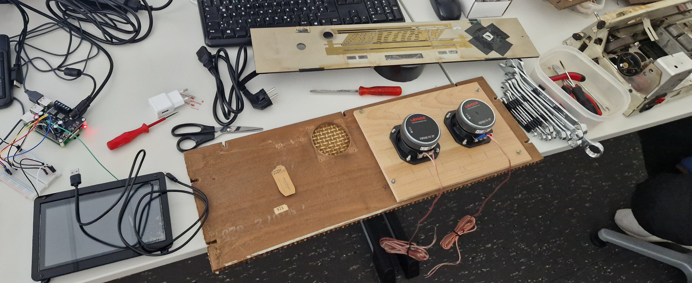

# Zusammenbau

Nach Wochen unter schweiß und tränen, haben wir alle Komponenten zusammengefügt
und noch Restarbeiten durchgeführt. Zusätzlich haben wir unserem Raspberry noch einen Lüfter spendiert.
Dieser kühlt die CPU um schlappe 30°.

## Lautsprecher Montage

## Lüfter verkabelung

## Raspy - Lüfter - LED-Streifen

## Lautsprecher verlöten

Hinweis: der hier gezeigte HiFi Berry wurde wieder zurückgeschickt  
und es wurde stattdessen ein externe Verstärke für die Lautsprecher genutzt.</b>

## Pins anstecken

## Rückseite - Verkabelung

## Vorderseite - Einbau Chassie

## Raspy Einbau
