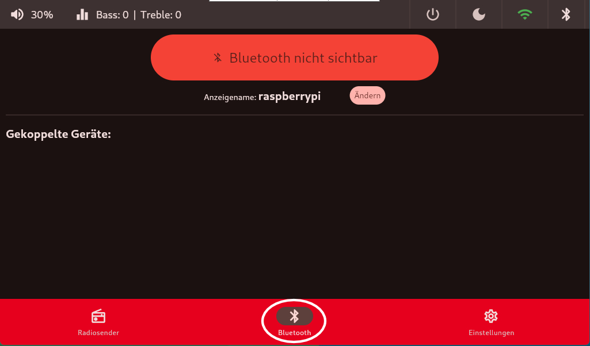
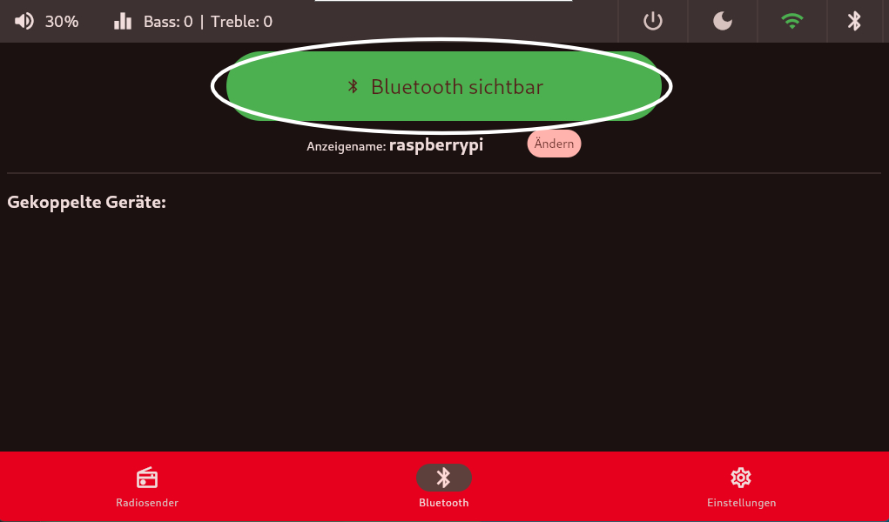
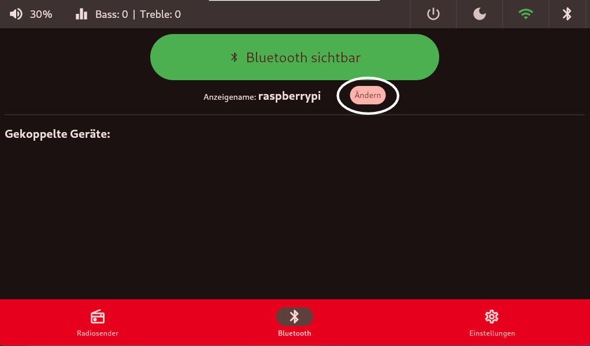
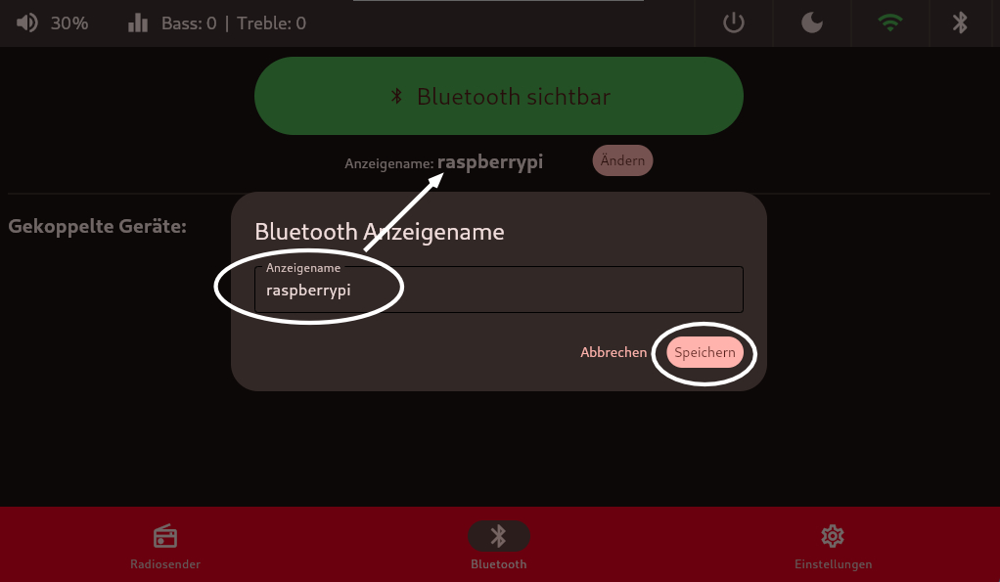

# Bluetooth-Kachel
Im unteren Menüband in der Kachel `Bluetooth` ist es möglich sich mit einem anderen `Bluetooth` Gerät zu verbinden und von diesem Audio-Signale zu empfangen.

Hier es es zum Beispiel möglich sich bequem per Handy mit dem Radio zu verbinden und Spotify oder andere Musikdienstleiter zu nutzen.

Mit einem Klick auf `Bluetooth nicht sichtbar` wird der `Bluetooth-Discovery` - Modus vom Raspberry Pi aktiviert und es ist möglich sich zu verbinden. Sobald eine Verbindung besteht wird der Gerätename und die MAC-Adresse angzeigt.

Wie in `Bluetooth-Einstellungen` üblich, kann man den Anzeigenamen des Raspberry Pi's anpassen.

