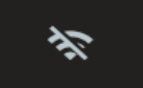
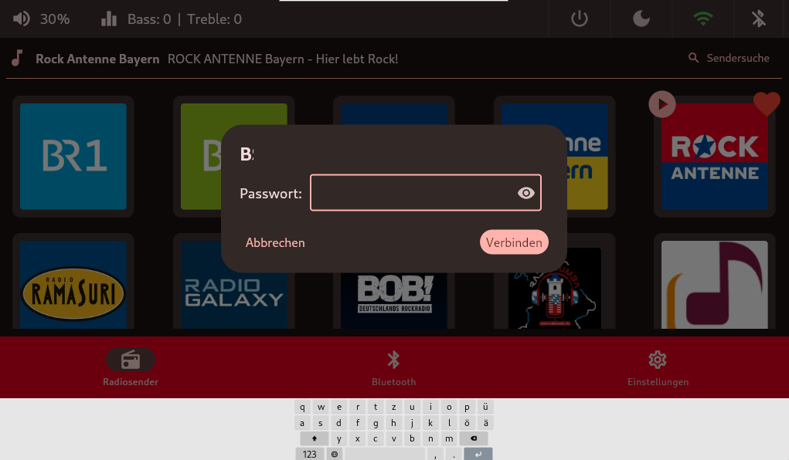

# W-LAN & LAN
Im oberen Menüband auf der rechten Seite ist es möglich sich mit einem W-LAN seiner Wahl zu verbinden.

## WLAN

Das `W-LAN Icon` hat zwei Statuse.

- Grün = mit W-LAN verbunden
- Grau und durchgestrichten = nicht verbunden

## WLAN-Suche
Sobald das WiFi eingeschaltet ist, startet die Netzwerksuche.

Nach Auswahl des gewünschten W-LAN's kommt bequem die Passwort abfrage in einem neuen Dialog-Fenster. 
Hier erscheint auch gleichzeitig eine Bildschirmtastatur zur Eingabe. Es ist aber auch möglich das Passwort mit einer normalen Tastatur einzugeben.

## LAN
Sobald ein `LAN-Kabel` eingesteckt ist, erscheint ein `LAN-ICON`.

