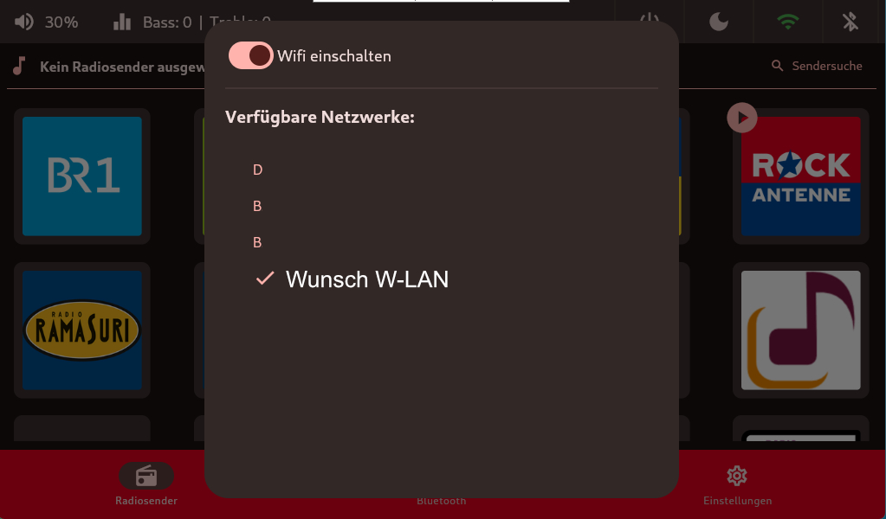

# W-LAN & LAN
Im oberen Menüband auf der rechten Seite ist es möglich sich mit einem W-LAN seiner Wahl zu verbinden.

Das `W-LAN Icon` hat zwei Statuse. 
- Grün = mit W-LAN verbunden 
- Grau und durchgestrichten = nicht verbunden 

## TODO SCREENSHOT Bild Grünes/Graues Symbol vom W-LAN

Sobald ein `LAN-Kabel` eingesteckt ist, erscheint ein `LAN-ICON`.

## TODO SCREENSHOT LAN SYMBOL

Sobald das WiFi eingeschaltet ist, startet die Netzwerksuche.

Nach Auswahl des gewünschten W-LAN's kommt bequem die Passwort abfrage in einem neuen Dialog-Fenster. 

Hier erscheint auch gleichzeitig eine Bildschirmtastatur zur Eingabe. Es ist aber auch möglich das Passwort mit einer verbundenen Tastatur einzugeben.

## TODO SCREENSHOT Screenshot Passwort Dialog Fenster

