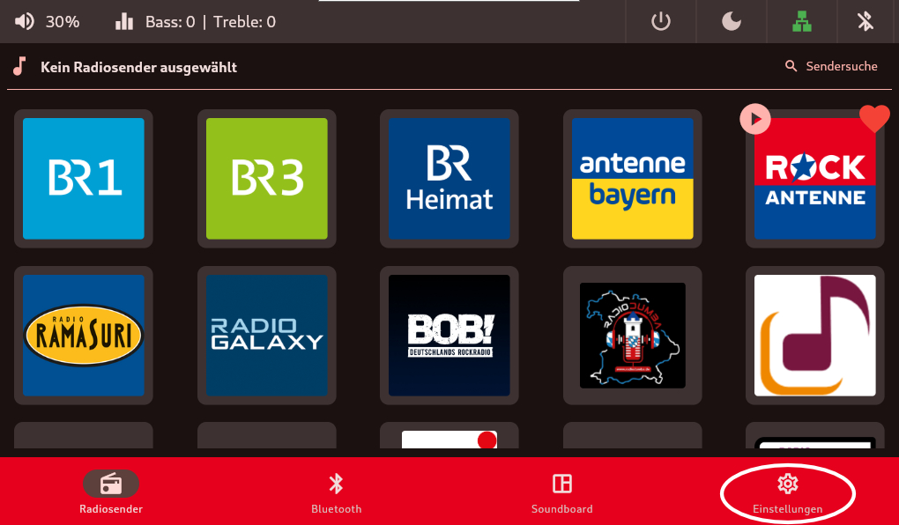
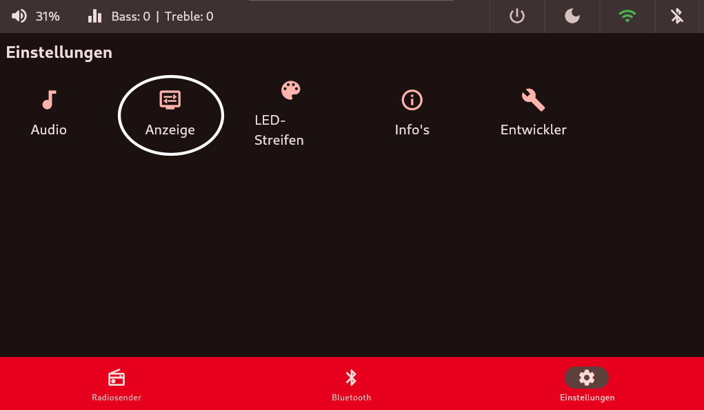
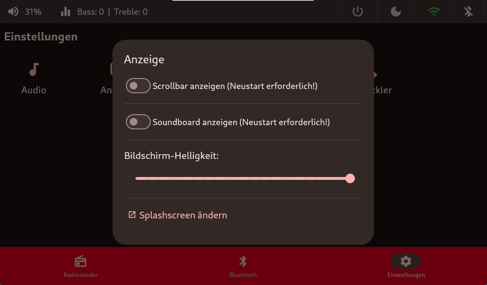
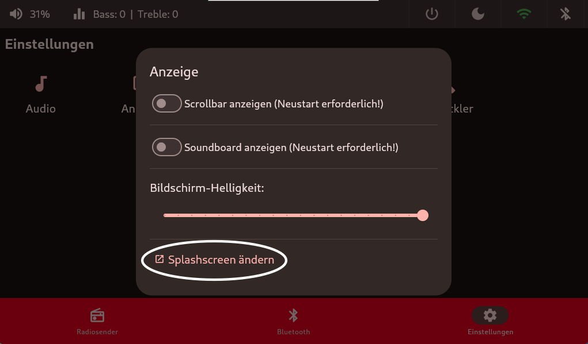
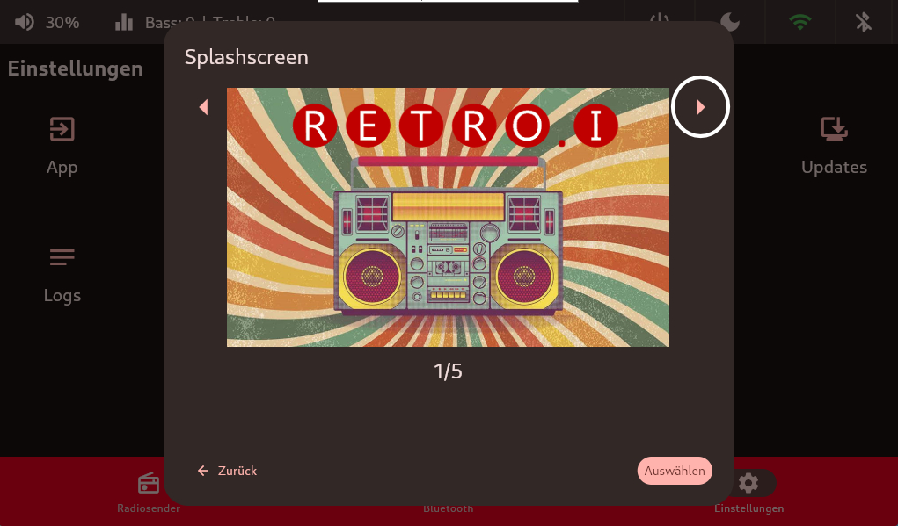
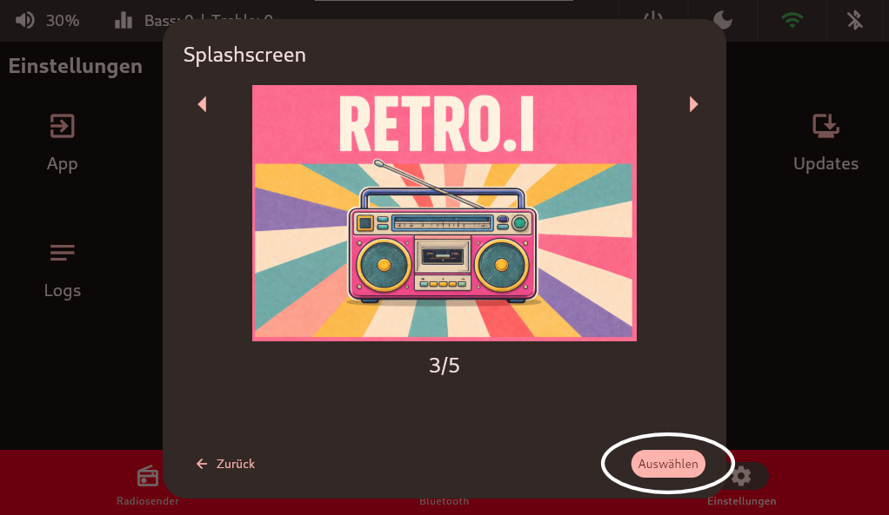

# Anzeige
## Scrollbar
Die Option Scrollbar kann genutzt werden, um auf einem Touchdisplay, die auf der rechten Seite befindliche Scrollbar zu verbreitern. Somit ist es möglich bequemer in der `Radiosender` Kachel hoch und runter zu scrollen.

## Bildschirm-Helligkeit
Der 2. Punkt steuert die `Bildschirm-Helligkeit`. Über den Slider ist es möglich die Helligkeit des Displays einzustellen.

 

 

## Soundboard aktivieren

## TODO Soundboard Text

## Splashscreen
Last but not least, ist es möglich den `Splashscreen` zu ändern. Diese Änderung setzt den `Splashscreen`, welcher beim hochfahren angzeigt wird und auch den Desktophintergrund auf das ausgewählte Bild.

 

 

