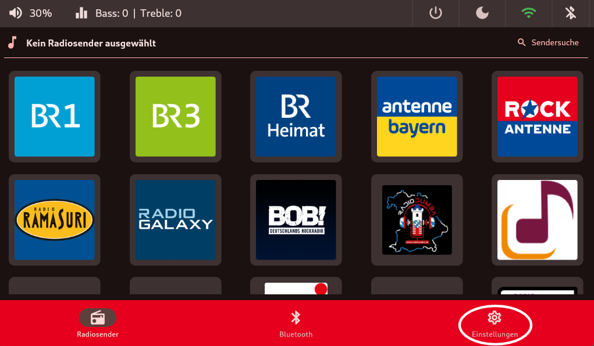
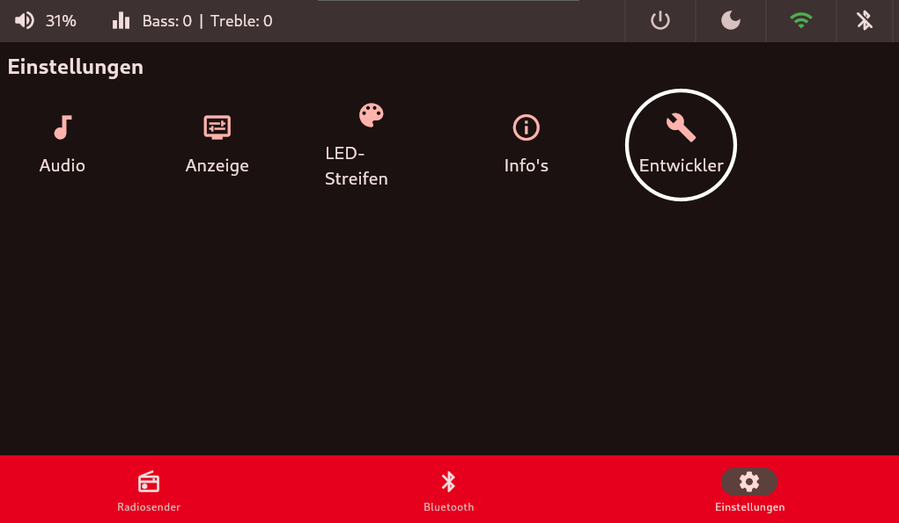
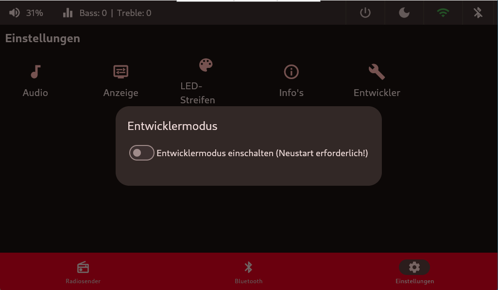
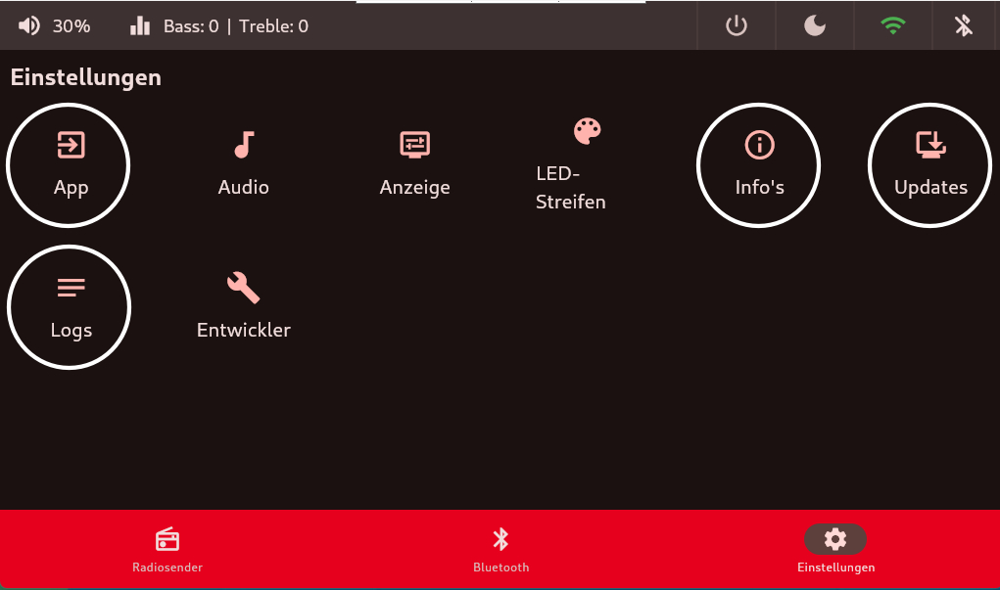
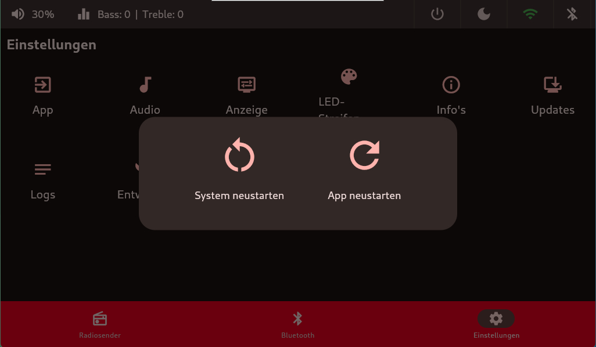
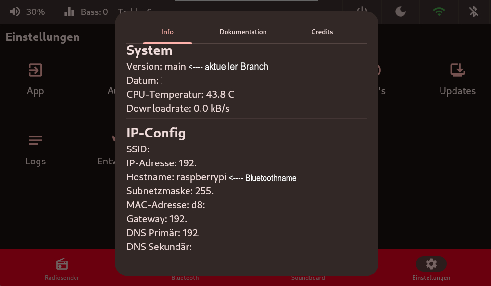
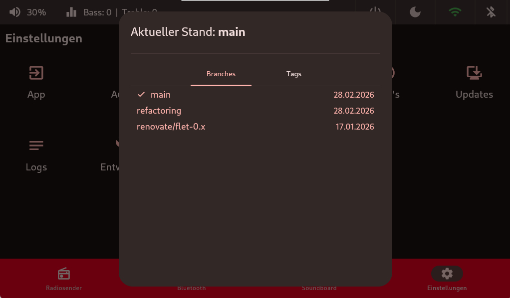
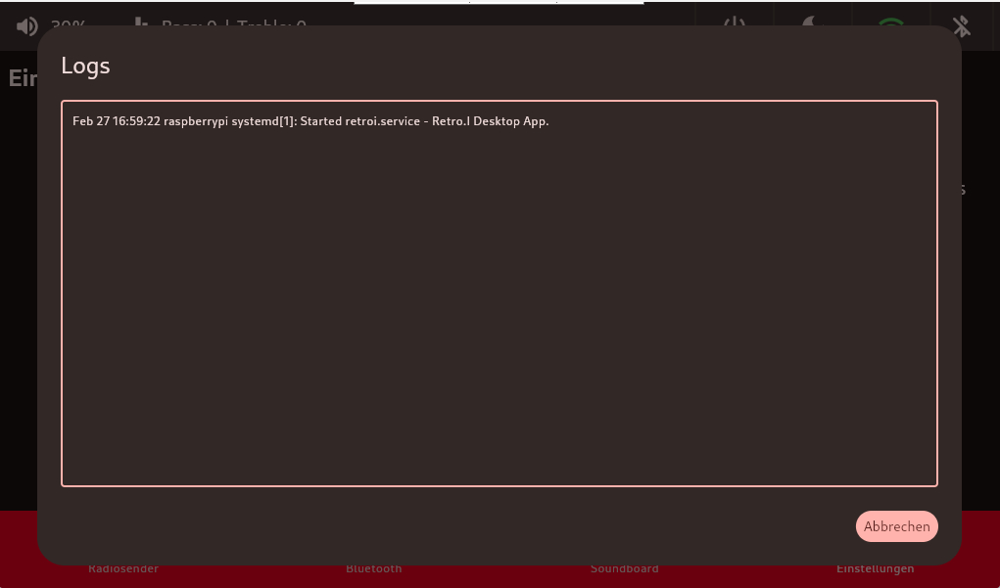

# Entwicklertools
Um die Entwicklertools einzublenden, muss man den Sliderbetätigen und die App neustarten.
Nachdem die Entwicklertools eingeschalten sind, gibt es in `Einstellungen` folgende Erweiterungen:

 

 

Nach einem Neustart stehen euch folgende Dinge zur Verfügung:

- App
- Info's (Systeminfos!)
- Updates
- Logs

## App Beenden / Neustarten
Hier kann bequem einfach nur die `Retro.I App` geschlossen oder neugestartet werden.

## Info's
Hier werden Systeminformationen angzeigt wie zum Beispiel IP oder MAC-Adresse.

## Updates GIT-Branches
Hier kann bequem zwischen neuen GIT-Repos hin und hergesprungen werden. Hierbei benötigt man keinen PC. Der Raspy lädt diesen herunter und installiert den GIT-Branche autark.

### Bild wird noch ergänzt

## Logs Retro.I Service
Hier wird das Journal des `Retro.I Services` angezeigt, die Logs werden zur Entwicklung und zum Debugging benutzt.

### Bild wird noch ergänzt

