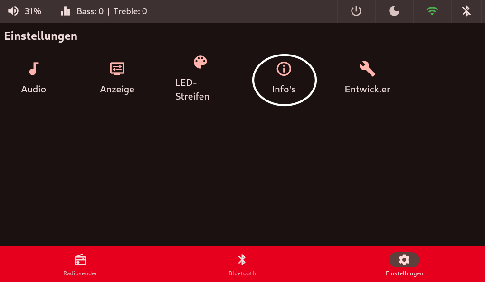
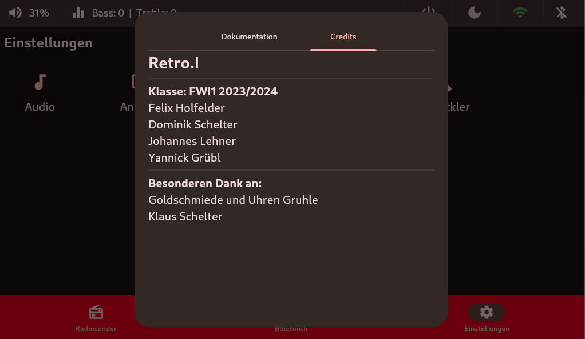

# Infos
## Dokumentation
Zusätzlich gibt es einen Tab `Dokumentation` hier steht der URL für die MKDocs Dokumentation. Es kann auch bequem der QR-Code gescannt werden um zur Dokumentation zu gelangen.

## Credits
In diesen`Credits` stehen alle Personen, welche an unserem `Retro.I` mitgewirkt haben.

