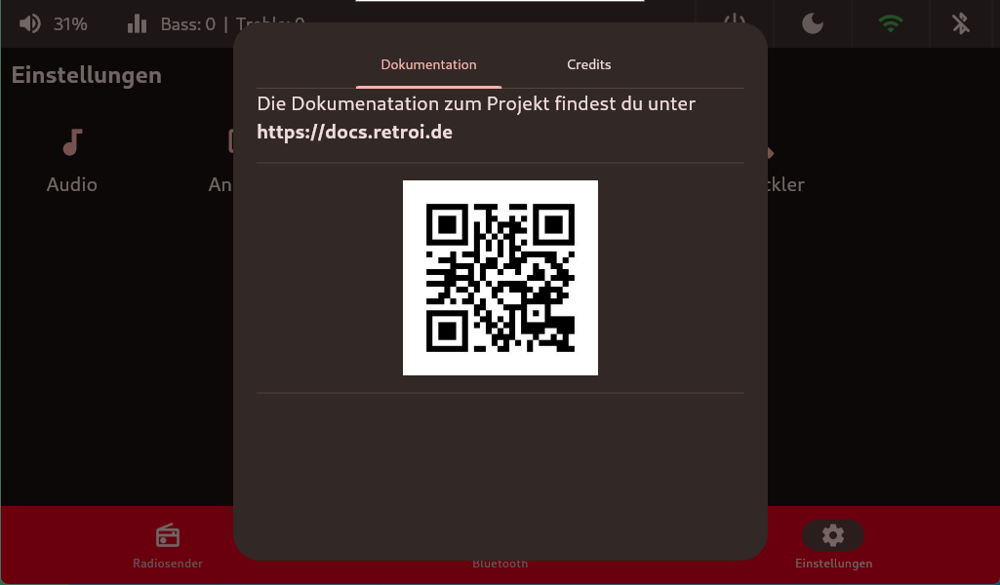

# Infos
## Dokumentation
In dem Tab `Dokumentation` steht die URL für die MKDocs Dokumentation. Es kann aber auch bequem der `QR-Code` gescannt werden um zur Dokumentation zu gelangen.

## Credits
In den `Credits` stehen alle Personen, welche an unserem `Retro.I` mitgewirkt haben.

