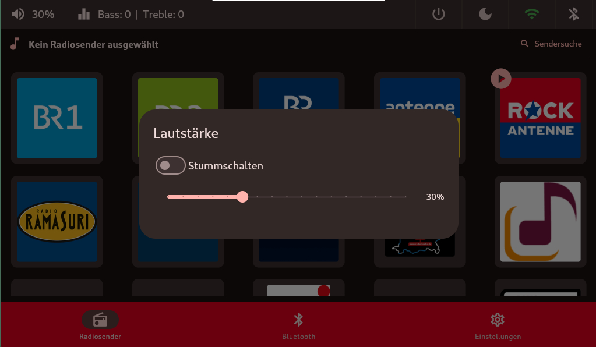
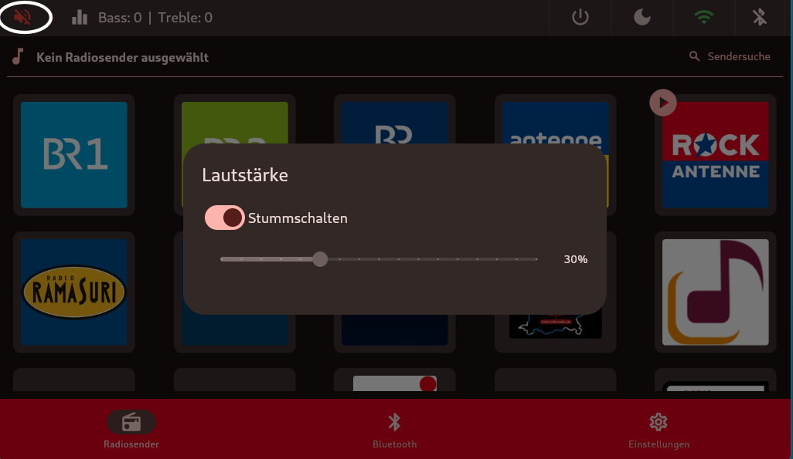
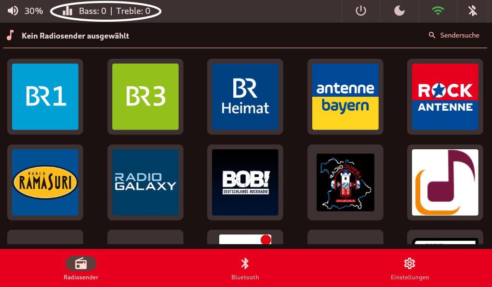
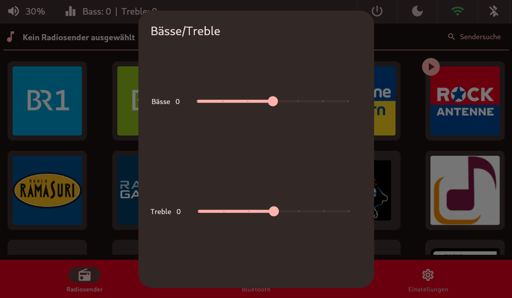

# Lautstärke, Stummschaltung & Equalizer
Hier gibt folgende Möglichkeiten:

- aktuelle Lautstärke anpassen
- Radio Stummschalten
- Equalizer Bass / Treble anpassen

## Lautstärke
 Sollte ein [LED-Streifen](led-streifen.md) benutzt werden, reagiert dieser auf eine Erhöhung oder Reduzierung der Lautstärke. Der LED-Streifen leuchtet beginnend, je nach Einbau von Links (von 0%) nach Rechts (bis zu 100%). Um diesen Wert zu berechnen gibt es im [Setup](../setup/index.md) die Abfrage wieviel LED's benutzt werden.

 

## Stummschaltung
 Bei Stummschaltung leuchtet der LED-Streifen durchgehend Rot. Eine Aufhebung der Stummschaltung stellt die ursprüngliche Farbe wieder her.
 Zusätzlich ändert sich das Symbol links oben.

## Equalizer
 Das gleiche Verhalten zeigt sich auch bei der Einstellung für Treble und Bass. Wobei diesmal von der Mitte ausgegangen wird und sich nach Links und Rechts leuchtend ausdehnt.
 

   
  

