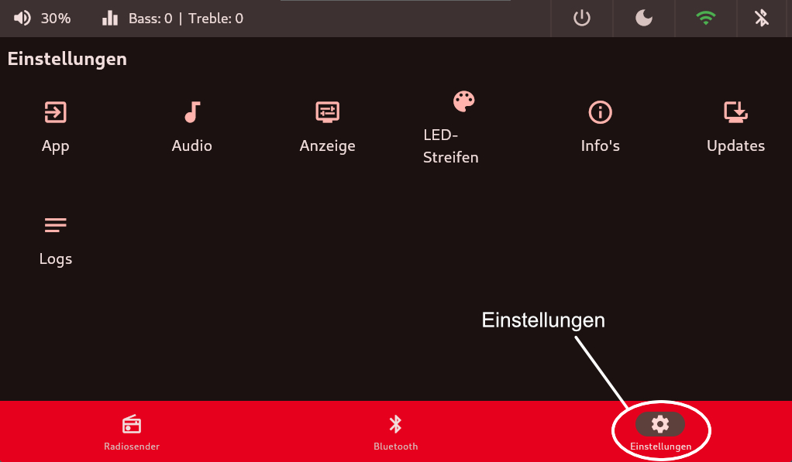
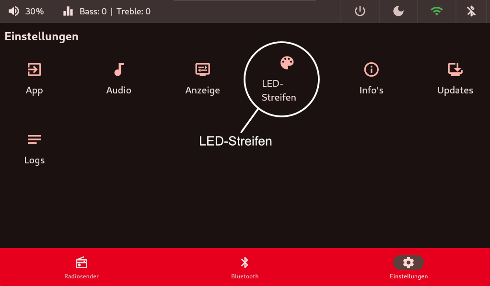
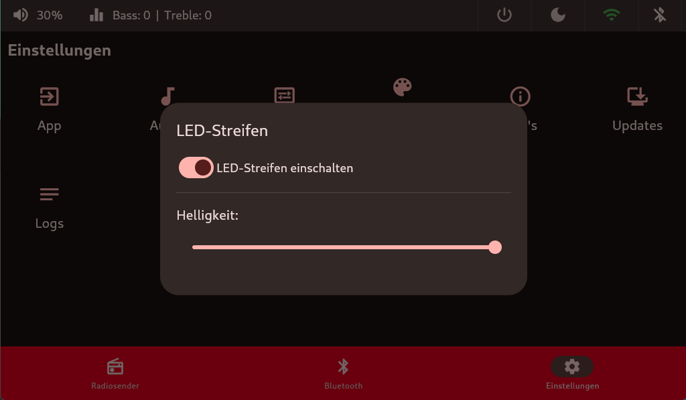
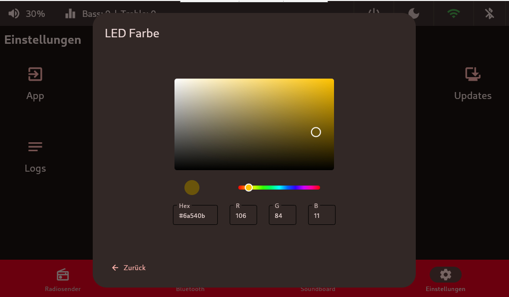

# LED-Streifen
Über die Kachel `Einstellungen` kann der Menüpunkt `LED-Streifen` ausgewählt werden.
Hier ist es möglich den LED-Streifen Ein- oder Auszuschalten. 
Zusätzlich ist es möglich über diesen über Schieberegler den zu dimmen.

 

LED-Streifen:

 - Ein- und Ausschalten
 - Dimmbar über Schieberegler
 - statische Farbe festlegen
 

 

## Farbauswahl
Die eingestellte Farbe wird direkt Live angepasst. Wenn die gewünschte Farbe ausgewählt ist, dann kommt man über `zurück` wieder in den ursprünglichen Dialog.

