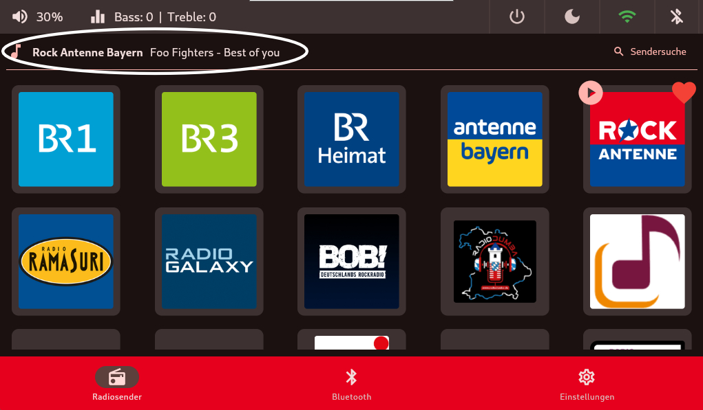
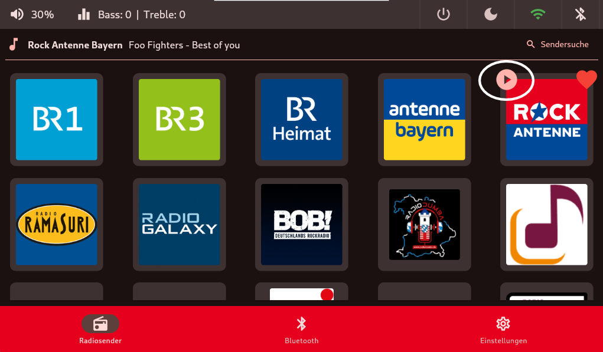
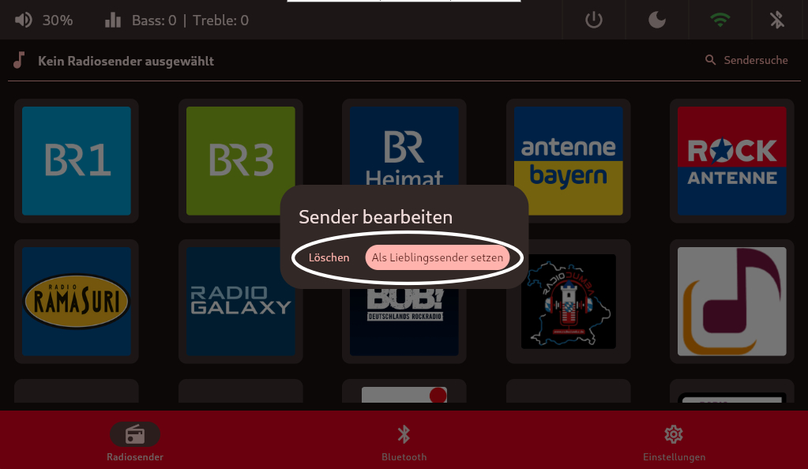

# Radiosender-Kachel
Auf der `Radiosender-Kachel` kann man per Touch oder Mausklick seine abgespeicherten Radiosender abspielen.

Sobald ein Radiosender ausgewählt wurde, werden die Metdaten des jeweiligen aktiven Sender angzeigt wie zum Beispiel der gerade laufende Titel und dem dazugehörigen Künstler.

Das `Playsymbol` zeigt den aktuell spielenden Radiosender.

Die Buttons der Radiosender funktionieren wie `Android-Apps`.

Ein längeres Drücken über das Touchfeld oder mit der Maus erzeugen einen neuen Dialog.
Hierbei ist es möglich den Sender zu löschen oder den gewählten als Lieblingssender einzustellen. In den [Audio-Einstellungen](audio.md) kann zusätzlich eingestellt werden, ob dieser dann beim Systemstart abgespielt werden soll oder nicht.

Hier kann ausgewählt werden ob der Radiosender gelöscht oder als Lieblingsradio sender markiert wird.

## TODO Sendersuche

