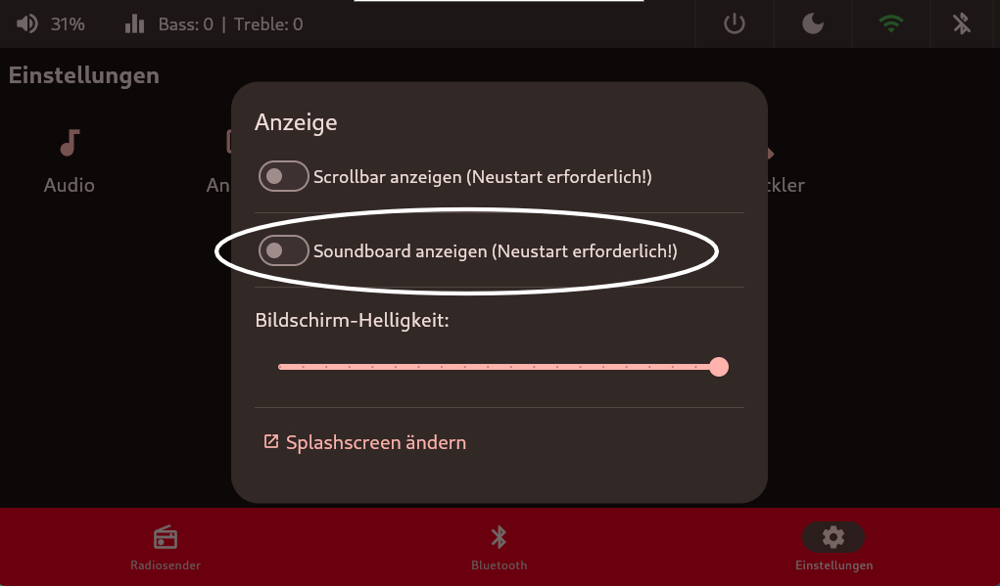
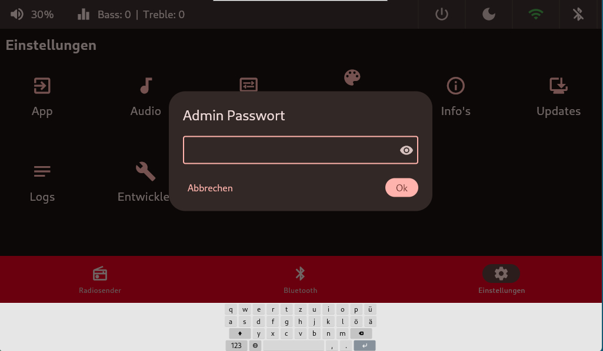
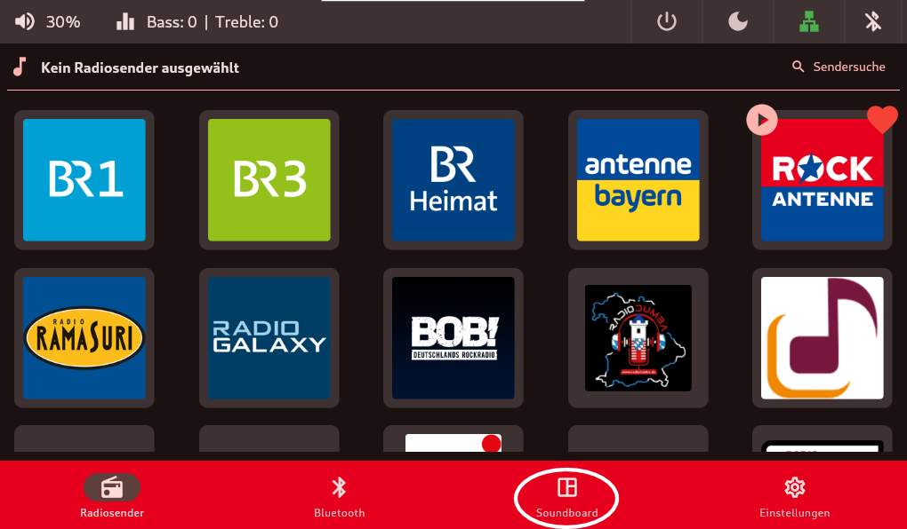
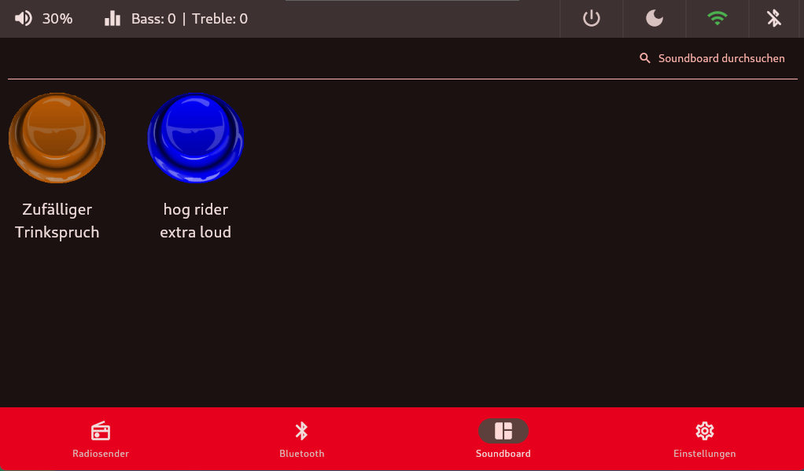

# Soundboard-Kachel
Das Soundboard ist Standardmäßig nicht aktiviert (im abgesicherten Modus) und muss über die [Anzeige](anzeige.md) erstmal eingeschaltet werden. Hierzu muss das Admin-Passwort welches bei der Installation angegeben wurde eingegeben werden.

 

 

 

Nach einem App Neustart - steht einem die Soundboard-Kachel zur Verfügung und es können verschiedene kurze Soundfiles abgespielt werden.

 

 

