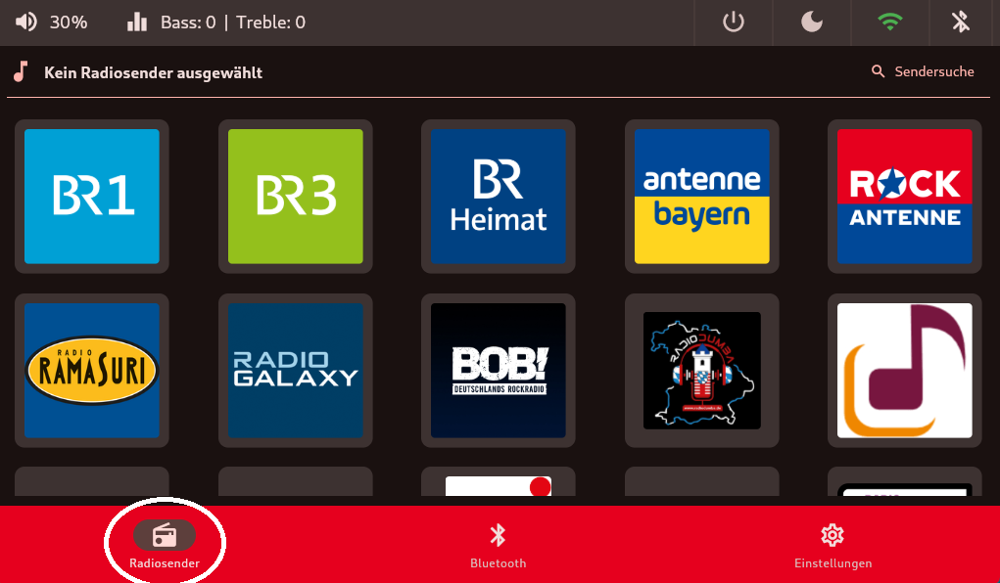

# Übersicht Startbildschirm
Hier eine kurze Übersicht über die Menüführung der `Retro.I App`.  

## Übersicht Menüführung
Beim Starten und Herunterfahren wird der ausgewählte Splashscreen angezeigt. Zusätzlich ertönt der typische Windows-Sound beim hochfahren.

Nach der Installation der `setup.sh` wird beim nächsten Start nur noch der Desktop, ohne Taskleiste, angezeigt und der ausgewählte Splashscreen wird zum Desktophintergrund. Der `retro.i-service` ist im Autostart hinterlegt und wird in kürze starten. Die `Radio-App` startet standardmäßig in der `Radiosender-Kachel`.

## Orientierung am Menüband

### obere Menüband
auf der linken oberen Seite: 
 - [aktuelle Lautstärke oder Anzeige für Stummschaltung](lautstaerke.md) 
 - [Equalizer Bass / Höhen](lautstaerke.md)

auf der rechten oberen Seite:  
 - [System Ein- und Ausschalter](on-off.md) 
 - [Dark/Lightmode](dark_light.md) 
 - [`W-LAN oder LAN`](WLAN.md)  
 - [`Bluetooth`](bluetooth.md) 

### untere Menüband
im unteren Menüband ist die Kachel [`Radiosender`](radiosender.md) beim Start als Standard ausgewählt.
Darüberhinaus gibt es noch [`Bluetooth`](bluetooth.md), [Soundboard](soundboard.md) (Einschalten in der [Anzeige](anzeige.md) möglich) und allgemeine `Einstellungen`.

In der Kachel [`Radiosender`](radiosender.md) befinden sich alle gespeicherten Radiosender.

### TODO Kachel Bluetooth Bild

In der Kachel [`Bluetooth`](bluetooth.md) kann man sich mit anderen Audio-Ausgabegeräten per Bluetooth verbinden.

### TODO Kachel Soundboard Bild

In der Kachel [Soundboard](soundboard.md) kann man verschiedene kurze Soundfiles abspielen. (Ähnlich wie bei TV Total).

### TODO Kachel Einstellungen Bild 

In der Kachel `Einstellungen` finden sich unter anderem allgemeine Einstellungen für den Radio wie zum Beispiel: Verhalten des LED-Streifens, Anzeige, Audio-Ausgabe, Standardlautstärke bei Start oder Systeminformationen wie die aktuelle IP.

### TODO Anregung: Nur ein Bild mit Kreisen?

