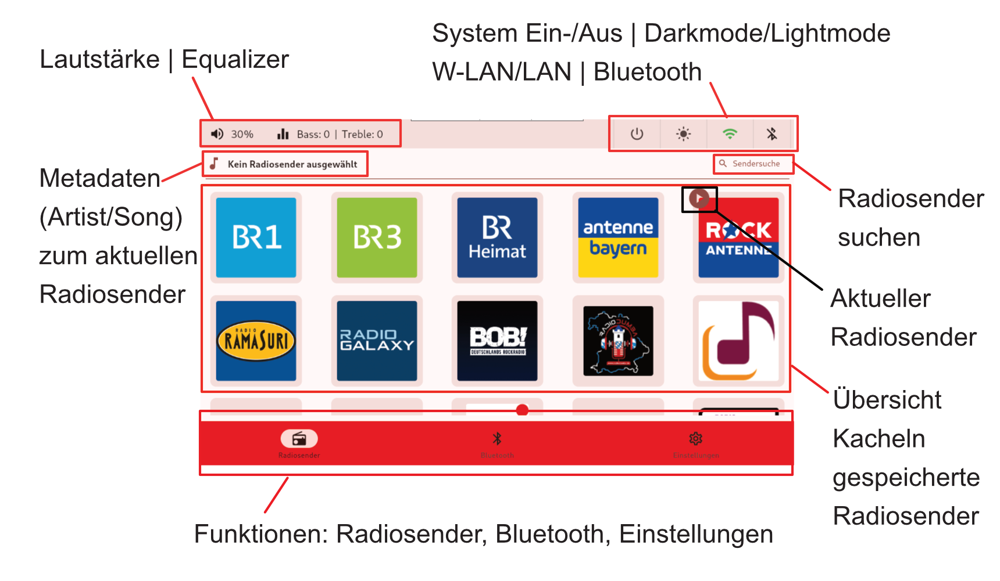

# Übersicht Startbildschirm
Hier eine kurze Übersicht über die Menüführung der `Retro.I App`.  

## Startbildschirm
Beim Starten und Herunterfahren wird der ausgewählte Splashscreen angezeigt. Zusätzlich ertönt der typische Windows-Sound beim hochfahren.

Nach der Installation der `setup.sh` wird beim nächsten Start nur noch der Desktop, ohne Taskleiste, angezeigt und der ausgewählte Splashscreen wird zum Desktophintergrund. Der `retro.i-service` ist im Autostart hinterlegt und wird in kürze starten. Die `Radio-App` startet standardmäßig in der `Radiosender-Kachel`.

## Orientierung am Menüband

### obere Menüband
Das obere Menüband beinhaltet auf der Linken oberen Seite:
 - aktuelle Lautstärke oder Anzeige für Stummschaltung
 - Equalizer Bass / Höhen

### TODO Screenshot Lautstärke
### TODO Screenshot Equalizer

auf der rechten oberen Seite:
 - System Ein- und Ausschalter 
 - Dark/Lightmode 
 - Anzeige [`W-LAN oder LAN`](WLAN.md) 
 - [`Bluetooth`](bluetooth.md) Anzeige 

 ### TODO Screenshot System Ein- und Assschalter
 ### TODO Dark/Lightmode

### untere Menüband
im unteren Menüband ist die Kachel [`Radiosender`](radiosender.md) beim Start als Standard ausgewählt. 
Darüberhinaus gibt es noch [`Bluetooth`](bluetooth.md) und [`Einstellungen`](einstellungen.md).

In der Kachel [`Radiosender`](radiosender.md) befinden sich alle gespeicherten Radiosender. 

### TODO Kachel Bluetooth Bild

In der Kachel [`Bluetooth`](bluetooth.md) kann man sich mit anderen Audio-Ausgabegeräten per Bluetooth verbinden. 

### TODO Kachel Einstellungen Bild 

In der Kachel [`Einstellungen`](einstellungen.md) finden sich unter anderem allgemeine Einstellungen für den Radio wie zum Beispiel: Verhalten des LED-Streifens, Anzeige, Audio-Ausgabe, Standardlautstärke bei Start oder Systeminformationen wie die aktuelle IP. 

### TODO Anregung: Nur ein Bild mit Kreisen?

