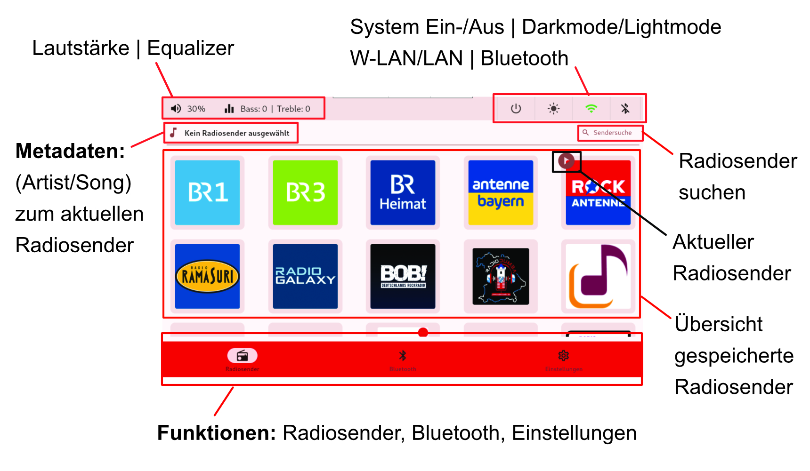
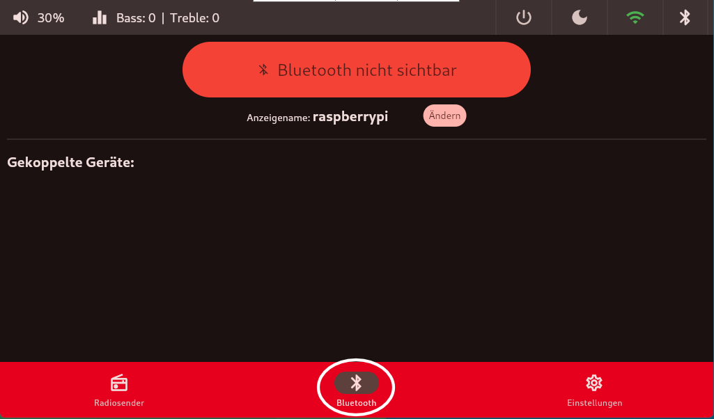
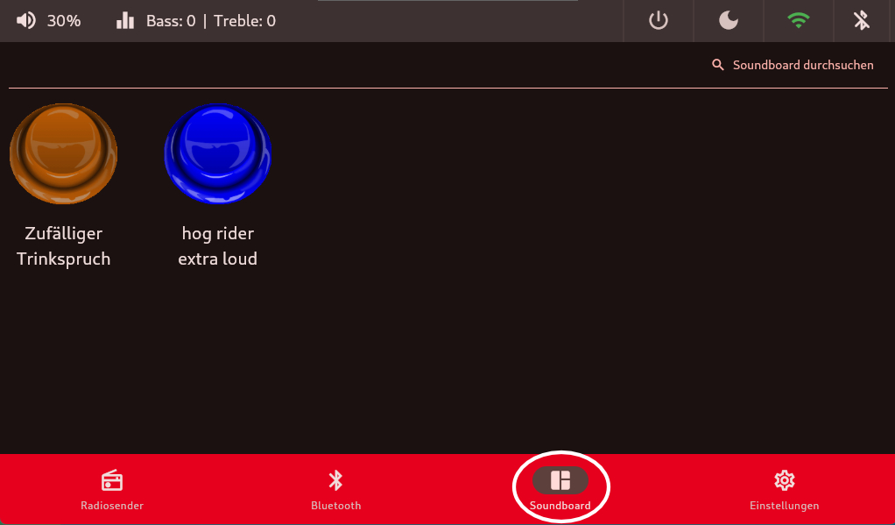
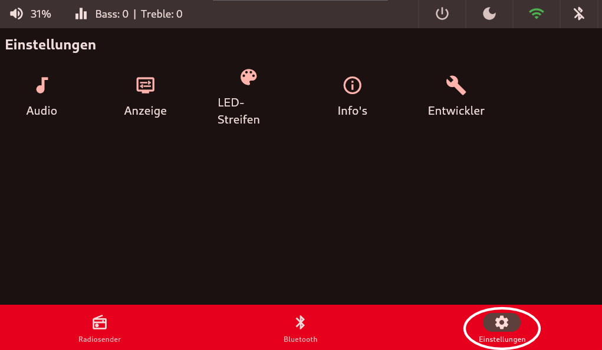

# Übersicht Startbildschirm
Hier eine kurze Übersicht über die Menüführung der `Retro.I App`.

## Übersicht Menüführung
Beim Starten und Herunterfahren wird der ausgewählte Splashscreen angezeigt. Zusätzlich ertönt der typische Windows-Sound beim hochfahren.

Nach der Installation der `setup.sh` wird der Raspy beim nächsten Start ohne Taskleiste hochgefahren. Der ausgewählte Splashscreen wird zum Desktophintergrund. Der `Retro.I-Service` ist im Autostart hinterlegt und wird in kürze starten. Die `Radio-App` startet standardmäßig in der `Radiosender-Kachel`.

## Orientierung am Menüband

### obere Menüband
auf der linken oberen Seite:

 - [aktuelle Lautstärke oder Anzeige für Stummschaltung](lautstaerke.md)
 - [Equalizer Bass / Höhen](lautstaerke.md)

auf der rechten oberen Seite: 

 - [System Ein- und Ausschalter](on-off.md)
 - [Dark/Lightmode](dark_light.md)
 - [`W-LAN oder LAN`](WLAN.md) 
 - [`Bluetooth`](Bluetooth.md) 

### untere Menüband
im unteren Menüband ist die Kachel [`Radiosender`](radiosender.md) beim Start als Standard ausgewählt.
Darüberhinaus gibt es noch [`Bluetooth`](Bluetooth.md), [Soundboard](soundboard.md) (Einschalten in der [Anzeige](anzeige.md) nötig) und allgemeine `Einstellungen`.

## Radiosender-Kachel

In der Kachel [`Radiosender`](radiosender.md) befinden sich alle gespeicherten Radiosender und zeigt den aktuellen Radiosender an (insofern einer ausgewählt ist).

## Bluetooth-Kachel

In der Kachel [`Bluetooth`](Bluetooth.md) kann man sich mit anderen Audio-Ausgabegeräten per Bluetooth verbinden.

## Soundboard-Kachel

In der Kachel [Soundboard](soundboard.md) kann man verschiedene kurze Soundfiles abspielen. (Ähnlich wie bei TV Total).
Diese ist nur aktiv wenn man beim Setup den abgesicherten Modus ausgeschalten hat. Hierzu muss man auch ein Admin-Passwort erstellen, welches dann abgefragt wird sobald man die Kachel wieder einschalten wird. Siehe [Eingabe-Admin Passwort](setup/systemeinrichtung.md)

## Einstellungen-Kachel

In der Kachel `Einstellungen` befinden sich unter anderem allgemeine Einstellungen für den Radio wie zum Beispiel: Verhalten des LED-Streifens, Anzeige, Audio-Ausgabe, Standardlautstärke bei Start oder Systeminformationen wie die aktuelle IP.

